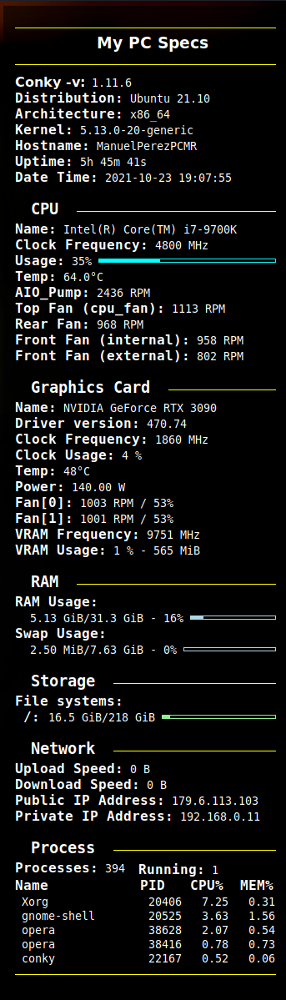

# My Conky Configuration
* This is my simple configuration for the Conky System Monitor

## Requirements:
* Conky ([Here intallation](https://github.com/brndnmtthws/conky/wiki/Installation#debian--ubuntu))
* NVIDIA Graphic Card - Only for Monitorize purposes, if you don't have one, just delete or comment the GPU lines on `.conkyrc`
* NVIDIA GPU Driver Installed ([Here installation](https://www.cyberciti.biz/faq/ubuntu-linux-install-nvidia-driver-latest-proprietary-driver/))

## Installation
* Just copy the `.conkyrc` in `~/.conkyrc` with **`644`** permissions:
  ```
  $ cp .conkyrc ~/.conkyrc
  $ chmod 644 ~/.conkyrc
  $ chown $USER:$USER ~/.conkyrc
  ```

## Run your Conky at startup
* You need to create a background process where Conky will be running, in the distro that is use which is **Ubuntu**, I create it in *Startup Applications Preferences*, first we need to create a bash file for example `conky-startup.sh` that is placed in this repo.

* In my case, I prefered to executed it from *$HOME* folder, you can execute wherever place you want. Remember that you need to execute that bash file as an application, so:


  ```
   $ chmod a+x conky-startup.sh
  ```

* Then created the background process depending on your distro, here you can find the steps for Ubuntu:


* It will be the first time, so click on **Add**.

* And that's it, you need to restart/logout and when login you will see conky on your Desktop:


*  Feel free to customize it as you desire. Enjoy!!